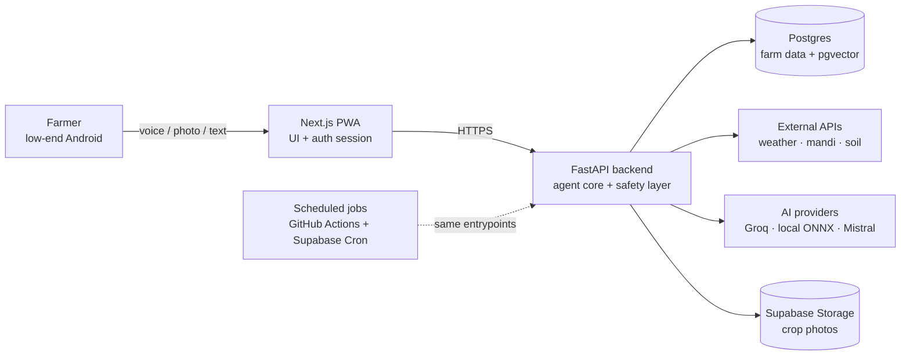
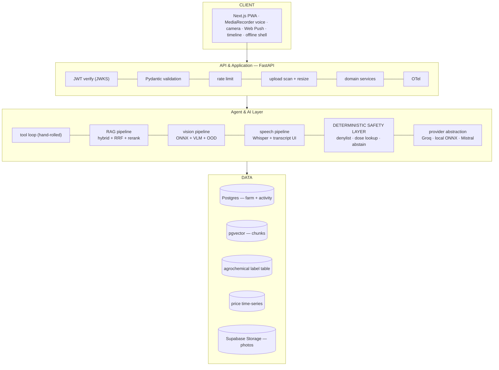
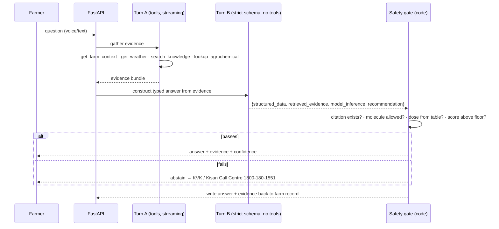
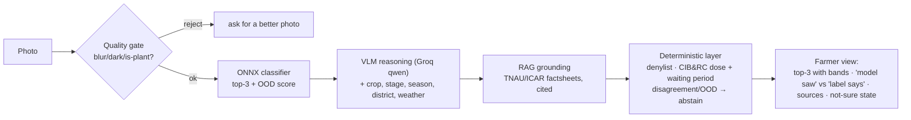
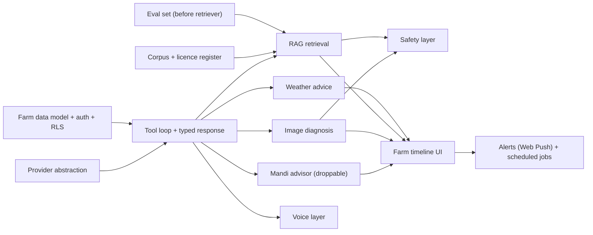

# Architecture Diagrams

GitHub renders ```mermaid``` fences natively.

## Simple architecture



## Detailed layers



## One request, end to end (two-call shape + safety gate)



## Crop image pipeline



## Feature dependency map


